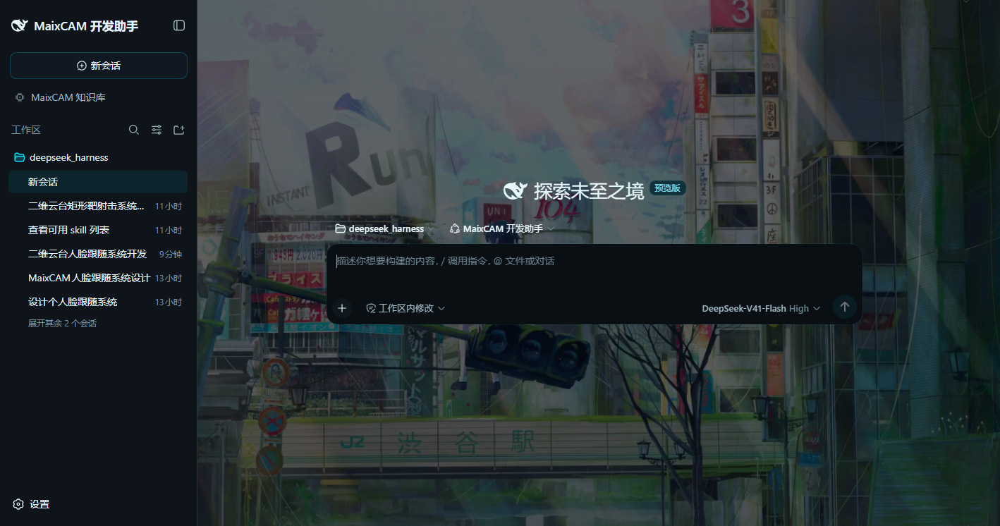

# MaixCAM 开发助手 · Harness 版本

> 这是同一个 MaixCAM 助手的**三种形态之一**。三种形态是**彼此独立、互不合并**的三个版本。

| 版本 | 仓库 | 讲什么 | 状态 |
| --- | --- | --- | --- |
| **教学版** | [`maixcam-rag-assistant`](https://github.com/QDchuan/maixcam-rag-assistant) | **从零讲原理**：语料怎么切、检索怎么算、防幻觉怎么校验、怎么评测 | 已完成 |
| **Harness 版本**（本仓库） | `maixcam-assistant-harness` | **应用价值**：以成熟底座做产品 | 进行中 |
| **Skill 版本** | — | **普及**：最轻形态，塞进任何桌面 Agent 即用 | 未开始 |

学原理去教学版；想直接有个能用的助手，用这个。



> 截图就是本仓库跑起来的样子：深色科技风 + 背景插画（无虚化、缓慢漂移）+ 半透明面板。
> 界面上的鲸鱼标记来自上游 DeepSeek Harness —— 应用内保留上游品牌，
> 只有**桌面/开始菜单那个启动器**用 MaixCAM 自己的图标。

---

## 它治什么病

起点是一句很具体的话：

> 当年打电赛的时候，MaixCAM 比较新，模型训练数据里几乎没有它相关的代码，
> 所以幻觉很严重，**写不出能用的代码**。

所以这个助手的核心不是「会聊天」，而是**答案有据可查**：

- 先检索本地知识库（MaixPy 教程 + API 文档，3838 片 / 1898 个 API 符号），**再**作答；
- 写进代码的每一个 API 名字，都用 `lookup_api` 核对过精确签名；
- 交付代码前，整段过一遍 `check_api_usage`（机器判，不是模型说了算）；
- 查不到就直说「本地知识库里没有这部分」，**不用看起来合理的代码把空白填上**。

## 装 & 跑

**最终用户**：双击仓库根目录的 **`setup.cmd`**。

它会检查 Node / pnpm → 装依赖 → 构建 → 建应用自己的 home → **在桌面和开始菜单各放一个
「MaixCAM 开发助手」**。装完双击那个图标就行（它会自动开浏览器，**不留控制台窗口**）。
可以重复运行，每一步都先检查再动手。

**已经装过、只想换端口或看日志**：

```bat
maixcam\start.cmd          :: 前台启动，留一个控制台窗口，能看到日志
maixcam\start.cmd 9001     :: 换端口
```

它用**自己的 home**：`C:\Users\chuan\.dsh-maixcam` —— 会话、工作区、设置、凭据、
preset 全部与机器上其它 dsh 安装互不相干。

等价的手工命令：

```bat
set DSH_HOME=C:\Users\chuan\.dsh-maixcam
node apps/cli/lib/bin.js --profile maixcam --patch maixcam\app.patch.yml --port 8890
```

> **每次启动 token 都会变，旧 URL 会失效。** 用桌面那个快捷方式，别存 URL。

### 安装脚本踩过的两个编码坑

Windows 上这类脚本很容易「看起来写对了但跑不起来」，两个都是编码：

1. **`.ps1` 会被 PowerShell 5.1 当成 ANSI 读。** `install.ps1` 里有中文，没 BOM 的话
   中文全变乱码，字符串被截断，报的却是「语法错误」—— 找半天找不到。**存成 UTF-8 with BOM**；
   `setup.cmd` 里也优先调 `pwsh`（PowerShell 7 默认按 UTF-8 读）。
2. **`.vbs` 被 WScript 按 ANSI 读。** `launch.vbs` 的注释写成**纯 ASCII**，不留中文。

（同样的坑在 `maixcam\start.cmd` 上也踩过：cmd.exe 用启动时的 ANSI 码页解析 `.cmd`。）

## 它由三块组成

| 块 | 在哪 | 是什么 |
| --- | --- | --- |
| **前端（壳）** | `packages/client/ui-theme/src/styles/maixcam.css` 等 | 深色科技风主题 + 品牌。**改的是令牌层，上游 CSS 一行没动** |
| **知识库能力** | `maixcam/assistant-shell/` | 语料加载与校验、混合检索、符号白名单、三个 agent 工具、知识库面板 |
| **检索纪律** | `maixcam/skills/maixcam-kb/SKILL.md` | 把「查到什么程度才算够」写成 Skill，交给 agent |

## 关于检索：我手写过三版，每一版都更差

这一段值得单独讲，因为它是这个项目最贵的一课。

**第一版**：自己写嵌入 + 余弦 top-k。
**第二版**：加了自己的 BM25、自写分词器、自己的 RRF 融合。
**第三版**：让检索工具自己去调 LLM 扩查询、自己拍相关性阈值、自己决定拆几个面。

三版都更差，根因是同一个：

> **我把 agent 该做的事塞进了检索工具里。**

工具不可能知道 **agent 看完成果之后还缺什么**。用一个工具调用去模拟「查 → 读 →
发现不认识的函数 → 再查」这个循环，只会又贵又差。

**正确的分工**：

- **检索保持笨而可靠** —— 一问 → 一批文章 + 出处，不带任何"聪明"的推理；
- **循环交给 agent** —— `maixcam-kb` 这个 Skill 规定查到什么程度才算够。

配套的实测证据（同一个问题「设计一个二维云台人脸跟随系统」）：

| | 结果 |
| --- | --- |
| 只有整句查询 | 命中 6 条切片，**其中 5 条来自同一篇文档** |
| 拆成子系统后 | 舵机 PWM、串口 UART、引脚 pinmap、供电各自拿到证据 |

## 改过上游哪些地方

```
apps/web/index.html                       标题 + lang=zh-CN
apps/web/public/favicon.svg               鲸鱼 → MaixCAM 摄像头模组
apps/web/public/manifest.webmanifest      name / short_name
apps/web/public/bg.jpg                    背景插画
packages/bundle/web-app/cordis.patch.yml  默认 preset → maixcam-assistant
packages/client/locale/…/zh.ts, en.ts     brand.localBuild → MaixCAM 开发助手
packages/client/ui-sidebar/…/SidebarRoot.tsx        品牌标记 fallback
packages/client/ui-conversation/…/EmptyHero.tsx     首屏动画鲸鱼 → MaixCamHeroMark
packages/client/ui-settings-models/…/locales.ts     欢迎文案
packages/client/ui-theme/src/client/styles.ts       挂上 maixcam.css
packages/client/ui-theme/src/styles/maixcam.css     深色科技风主题（新）
pnpm-workspace.yaml                       加 maixcam/assistant-shell
maixcam/                                  应用自己的东西（新）
```

主题那一层的做法值得一提：上游的设计系统分**原始色板**（`--dsw-static-*`）与
**语义层**（`--dsw-alias-*`），组件只读语义层。所以整个换肤只需要覆盖令牌，
**上游那 340 行 CSS 一行没改** —— 以后同步上游不会有冲突。

踩过的两个坑写在 `maixcam/README.md` 里：只改语义层时侧栏仍是白底（要连原始中性色阶一起反转）；
用户消息气泡的底色是 `--dsw-static-blue-50`，漏掉它会变成白底浅字、**用户自己发的话完全看不见**。

## 从源码构建

```bash
pnpm install --frozen-lockfile
pnpm run build              # 宿主 + 客户端 + Web 前端
pnpm run build:lib:client   # 只改了客户端半边（快）
pnpm run build:web          # 只改了 index.html / 静态资源
```

## 还没做的

- **资料库浏览视图** —— 像 ima 那样在 Web 端按模块浏览全部文档。需要一条
  `/api/maixcam/library` 路由 + 面板里的一块浏览界面。
- **评测闭环** —— 教学主线那套 eval（recall / MRR / citation precision）
  **从没在这个分支跑过**。检索的每一轮改动都是凭手感调的，这是最该补的一块。
- **Skill 版本** —— 三种形态里的第三种，一行没写。

## 上游与许可

基于 [DeepSeek Harness](https://github.com/deepseek-ai/deepseek-harness)（MIT）
`c291e79` 构建。上游原始说明保留在 [`README.upstream.md`](./README.upstream.md)
与 [`README.upstream.zh.md`](./README.upstream.zh.md)。


第三方声明见 [`THIRD_PARTY_NOTICES.md`](./THIRD_PARTY_NOTICES.md)。
本仓库为私有仓库，且**当前是无历史的快照**（见「上游与许可」上方那段）。
许可为 **MIT**，见 [`LICENSE`](./LICENSE)；第三方声明见 [`THIRD_PARTY_NOTICES.md`](./THIRD_PARTY_NOTICES.md)。
